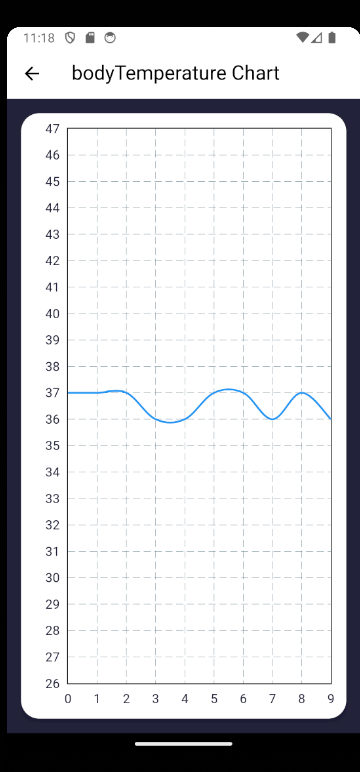
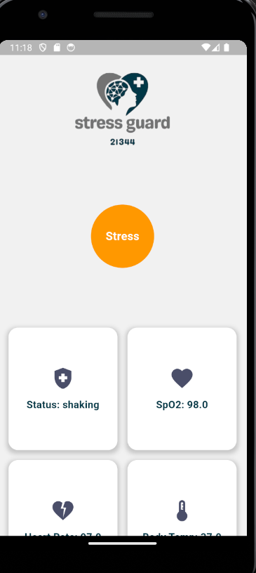
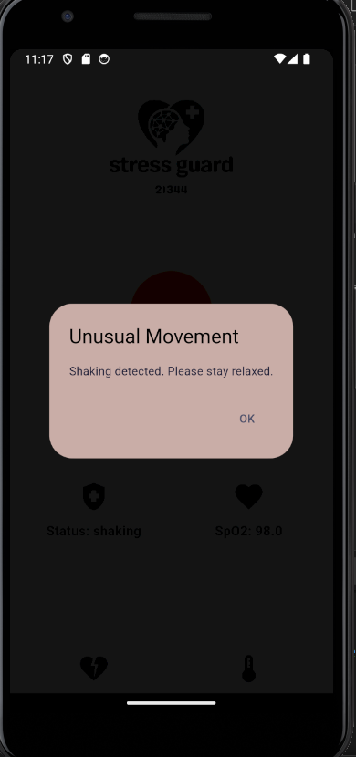

# 🛡️ Stress Guardian: Real-Time Stress Detection Using IoT + Flutter + Firebase

> Your personal stress sentinel — blending wearable tech and real-time visualization to help you live healthier.

---

## 🌟 Overview

**Stress Guardian** is a full-stack IoT solution for monitoring physical and environmental stress indicators. It collects real-time biometric and environmental data, pushes it to the cloud via Firebase, and displays it on a beautiful and responsive Flutter mobile app.

From heartbeat spikes to poor air quality — the system **detects early signs of stress** and helps you act before it escalates.

---

## 🔑 Key Features

- 📡 **Real-Time Stress Tracking**  
  Monitors heart rate, SpO₂, body temperature, motion activity, humidity, and air quality.

- 📱 **Mobile Visualization**  
  A Flutter app displays live readings in clean, colorful graphs with alerts for abnormal values.

- ☁️ **Cloud Integration with Firebase**  
  All sensor data is securely stored in **Firebase Firestore** and synced instantly with the mobile app.

- 🌍 **Environmental Monitoring**  
  Includes ambient temperature, humidity, and gas levels (MQ135), which impact stress levels.

- 🚨 **Smart Alerts**  
  Automatically notifies users of stressful or unsafe readings through the mobile app.

---

## 🧬 Firestore Data Schema

Each record pushed to Firebase Firestore includes the following fields:

| Field             | Description                                 |
|------------------|---------------------------------------------|
| `status`         | Motion/activity state (`idle`, `moving`, etc.) |
| `SpO2`           | Blood oxygen saturation percentage (%)      |
| `heartRate`      | Beats per minute (BPM)                      |
| `temperature`    | Ambient temperature (°C)                    |
| `bodyTemperature`| Body surface temperature (°C)               |
| `humidity`       | Humidity level (%)                          |
| `MQ135`          | Air quality score (%)                       |
| `timestamp`      | Date-time of data capture (e.g. `2025-04-30-14-30-05`) |

---

## 📱 Mobile App Highlights (Flutter)

The **Flutter mobile application** is the user interface for live stress monitoring. It connects directly to Firestore and renders incoming sensor data with smooth, real-time charts and color-coded alerts.

### ✨ Features

- 📊 **Dynamic Graphs** (SpO₂, heart rate, temperature, etc.)
- 🔔 **Auto-Warnings** for elevated stress levels
- 📈 **Historical Trends** to track stress over time
- 👤 **User-friendly dashboard** with responsive design

---

## 🖼️ App UI Previews

| Graph Visualization              | App Main Interface              | Stress Alert Example              |
|----------------------------------|----------------------------------|-----------------------------------|
|         |       |            |

---

## 🔩 Components & Technologies

### 🛠️ Hardware Components

| Component             | Function                                  |
|----------------------|-------------------------------------------|
| **ESP32**            | Central microcontroller with Wi-Fi        |
| **MAX30105**         | Heart rate and SpO₂ sensor                 |
| **ADXL345**          | 3-axis accelerometer for movement detection|
| **DHT11**            | Temperature and humidity sensor            |
| **MQ135**            | Gas sensor for air quality                 |
| **Analog Body Temp** | Skin surface temperature sensor            |

### 💻 Software Stack

#### 🔌 ESP32 (Arduino Code)

- `WiFi.h` – Connect to local networks
- `HTTPClient.h` – Send data to Firebase
- `ArduinoJson.h` – Format data as JSON
- `Adafruit_ADXL345_U.h` – Handle movement detection
- `MAX30105.h`, `spo2_algorithm.h` – Biometric data processing
- `DFRobot_DHT11.h` – Read temperature & humidity
- `Wire.h` – I²C communication

#### 📱 Mobile App (Flutter)

- `flutter`
- `firebase_core`, `firebase_auth`, `cloud_firestore` – Firebase backend
- `fl_chart` – Beautiful, animated data charts

---

## 🚀 How It Works

1. **Sensing**: The ESP32 continuously reads inputs from biometric and environmental sensors.
2. **Data Upload**: Each reading is formatted in JSON and sent to Firestore using HTTP.
3. **Cloud Sync**: Firebase stores the data in structured documents with timestamps.
4. **Live Display**: The Flutter app listens for real-time updates and displays them graphically.
5. **Alerting**: If stress indicators cross critical thresholds, alerts are triggered automatically.

---

## 🧪 Use Cases

- 📈 **Daily Stress Management**
- 💼 **Workplace Wellness Programs**
- 🧘‍♀️ **Mindfulness & Biofeedback Apps**
- 🏥 **Remote Health Monitoring**
- 🌿 **Environmental Health Analytics**

---

## 🧾 License

This project is licensed under the [MIT License](LICENSE).

---

## 🙌 Acknowledgments

- 🧩 **Flutter** – Cross-platform UI magic
- ⚡ **Arduino IDE** – The brain behind the hardware
- 🔥 **Firebase** – Real-time database and cloud sync
- ❤️ The open-source community for making innovation possible

---

> _“Measure what matters. Understand what hurts. Act before it becomes a problem.”_  
> — **Stress Guardian Team**
